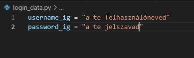

# Használat:
1. Hozz létre egy `login_data.py` file-t
2. hozz létre benne egy `username_ig` és egy `password_ig` változót.

3. Telepítsed a libary-kat: `instagrapi` ,  `rich` , `instabot` így: `pip install instagrapi rich instabot`
4. Indítsd el a main.py-file-t